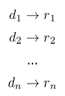
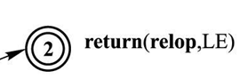
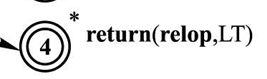
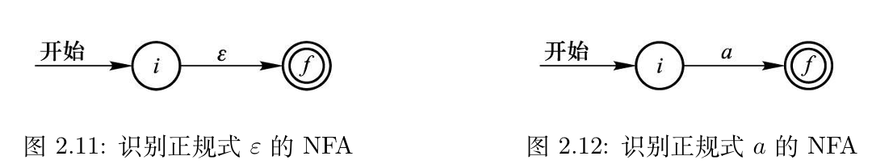
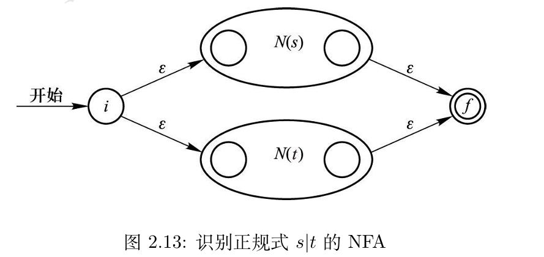
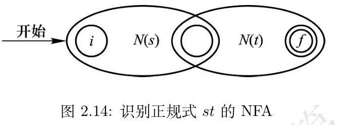
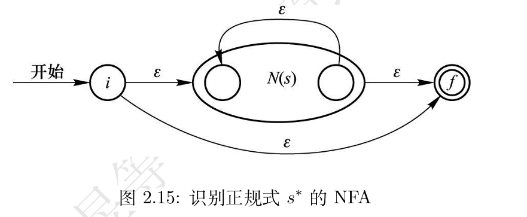
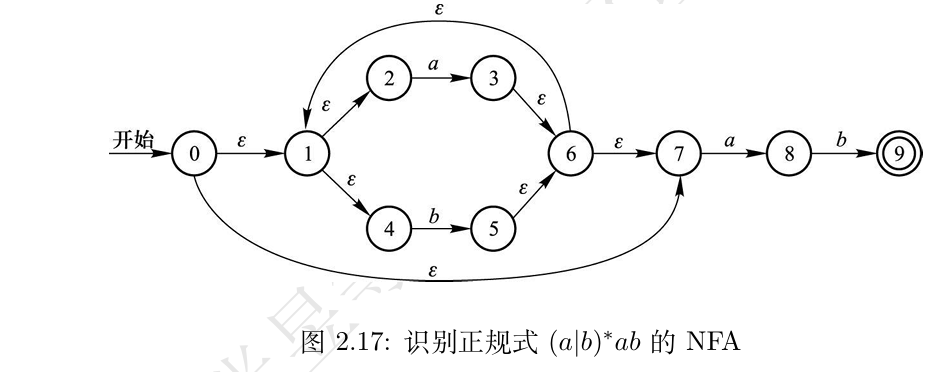

# 第二章 词法分析

## 2.1 词法记号及属性

词法分析过程中，编译器扫描**构成源代码的字符流**，产生用于**语法分析**的**词法记号序列**，其形式为2.1.1节提到的**词法记号**。

### 2.1.1 词法记号、模式、词法单元

**词法单元（lexeme）**：亦称单词/词素，源程序中有特定含义的字符序列，如$\mathrm{if}$、$+$。

**词法记号（token）**：亦称记号，由**记号名**（和**属性值**）构成的一元组<$\mathrm{name}$>或二元组<$\mathrm{name, attribute}$>。

* 记号名代表**一类词法单元**的抽象（概括性）名字，如程序中的标识符的记号名为$\mathbf{id}$。

* 对于只有一种属性的记号而言，属性值不是必须的，可以用一元组表示，比如说$\mathrm{if}$。

**模式（pattern）**：词法记号的**模式**描述了**该种词法记号所对应的词法单元**应有的形式。对于较简单的词法记号，比如说$\mathrm{if}$，其模式就是字符串"$\mathbf{if}$"，而其他一些词法记号的模式则更复杂，一般由一定的字符串匹配方式定义，比如说常见编程语言中的标识符定义规则。

### 2.1.2 词法记号的属性

一个词法记号的记号名可能对应**多个词法单元**。当这种情况出现时，为了**消除歧义**，需要在词法记号中加入属性值概念，从而记录这一“附加信息”。

## 2.2 词法记号的描述和识别

### 2.2.1 串、语言

**字母表**：符号的有限集合，比如说$\{a, b, c\}$、$\{0, 1\}$，ASCII字符集等。
**串**：某字母表中的字符构成的有限序列，比如说$\mathrm{USTC}$、$114514$。若某串仅含某字母表中的符号，则称其为**某字母表上的串**。

* **空串**：不包含任何符号的串，记作$\varepsilon$。
* **串的长度**：串中符号的个数。特别地，定义空串的长度为0。

对于**串**，可以定义**连接运算**和**幂运算**：

* **连接运算**：串$a$和串$b$的连接，记作$ab$。
* **幂运算**：串$a$的$n$次幂，记作$a^n$，其中$n$为非负整数，定义如下：
  * $a^0 = ε$
  * $a^{n} = a^{(n-1)} a$

**语言**：某字母表上的串的集合，比如说{$\mathrm{USTC}$, $114514$}、{$0011101$, $ε$}，其中的元素称作该语言的**句子**或**字**。

对于**语言**，可以定义**并**、**连接**、**闭包**和**正闭包**运算：

* **并运算**：$L1 \cup L2 = \{w | w \in L1 \text{或} w \in L2\}$
* **连接运算**：$L1L2 = \{w1w2 | w1 \in L1 \text{且} w2 \in L2\}$
* **闭包运算**： $L^* = \cup_{(i=0, \infty)} L^i$，即零个或多个$L$中的串相互连接构成的集合。
* **正闭包运算**：$L^+ = \cup_{(i=1, \infty)} L^i$，即一个或多个$L$中的串相互连接构成的集合。

### 2.2.2 正规式

**正规式/正则表达式（regular expression）**是用于描述某种语言的，形式化的表达式。

正规式的定义规则如下：

1. 归纳奠基：
   * 空串$ε$是一个正规式，它代表语言${ε}$。
   * 对于字母表中的每个符号$a$，$a$也是一个正规式，它代表语言${a}$。
2. 归纳步骤：若$r1$和$r2$是正规式，代表的语言分别为$L(r1)$和$L(r2)$，则以下式子也是正规式：
   * $r1 | r2$：$r1$和$r2$的并集，代表语言$L(r1) \cup L(r2)$
   * $r1r2$：$r1$和$r2$的连接，代表语言$L(r1)L(r2)$
   * $r1*$：$r1$的闭包，代表语言$L(r1)^*$
   * $(r1)$：代表语言$L(r1)$

**运算的优先级**：$*$ > $·$ > $|$，它们均为左结合的。

> 括号可以改变运算的优先级。

### 2.2.3 正规定义

可以按顺序对正规式命名，并在该命名语句的**后面**使用这些名字来指代对应的正规式，从而定义新的正规式：

另外，在正规式中，某些结构重复出现，为方便起见，赋予其特定的缩写形式：

1. **一个或多个实例**：用$+$表示，$r+ = rr*$，所以$r+$代表的语言为$L(r)^+$。
2. **零个或一个实例**：用$?$表示，$r? = r | ε$，所以$r?$代表的语言为$L(r) \cup {ε}$。
3. **字符组**：用$[...]$表示，如$[ABC]$（这里$A$、$B$、$C$代表字母表中的符号），代表的语言为${A, B, C}$，对应的正规式为$A | B | C$。
4. **缩写字符组**：用$[.-.]$表示，如$[a-z]$代表的语言为字母表中的所有小写字母，对应的正规式为$a | b | ... | z$。

### 2.2.4 状态转换图

状态转换图描述词法分析器在试图返回语法分析器可用的词法记号时的行为。

* 转换图上的每个节点代表一个**状态**。

* 每个边代表一个**输入符号**，它代表**状态转移条件**，当输入符号与状态转移条件匹配时，词法分析器将从一个状态转移到另一个状态。

* 有些状态带有两个圆圈，它代表一个词法记号被识别到，词法分析器将返回这个词法记号。

  

* 有些状态还带有一个星号$*$，它代表输入指针在进行接下来的识别任务之前，将回退一个字符。

  

## 2.3 有限自动机

有限自动机可以识别正规式描述的语言，其接受一个串作为输入，在有限个状态之间通过状态转移函数进行状态间的转换，最终输出该输入是否为某语言的句子的判断结果。
在编译原理中，有限自动机分为**不确定的有限自动机（Non-deterministic Finite Automata, NFA）**和**确定的有限自动机（Deterministic Finite Automata, DFA）**，下面分别进行介绍。

### 2.3.1 不确定的有限自动机（下称NFA）

NFA的本质是一个数学模型，可以写成一个五元组$N = <S, Σ, \mathrm{move}(·,·), s_0, F>$，其中：

1. $S$为一个有限集合，代表NFA的不同状态。
2. $Σ$代表NFA接受的输入符号，其中不含空串$ε$。
3. $\mathrm{move}: S \times (\Sigma \cup \varepsilon) \to \mathscr{P}(S)$是状态转移函数，它将一个状态和一个输入符号构成的二元组映射为一个状态的集合。
4. $s_0$为NFA的初始状态，该状态唯一。
5. $F$为NFA的终止状态集合，其中的状态可以为零个或多个。

> 注意，这里的$\mathscr{P}(S)$代表$S$的幂集，即$S$的所有子集构成的集合。
> 对于中科大计算机学院的同学们而言，该概念是《代数结构》课程的第一章的内容。

NFA可以用有向图来描述，其中的结点代表状态，边代表状态转移，边上的标签代表状态转移需要满足的条件。
在计算机的实际实现中，NFA可以用**状态转换表**来描述，其中的行代表状态，列代表输入符号，表中的元素代表状态转移的结果。

由NFA定义的语言，本质上就是NFA能够接受的句子的集合，即NFA能够从初始状态出发，通过状态转移函数，最终到达终止状态的句子的集合。

### 2.3.2 确定的有限自动机（下称DFA）

NFA中，状态转移函数$\mathrm{move}$的性质不好：

* 对于某个状态和某个输入符号，可能有多个状态作为转移结果，导致了状态转移的多值性，识别时开销大。
* 另外，NFA中的状态转移函数可以接受空串$ε$作为输入，这虽然使NFA在描述正规式的运算时更加灵活，但也大大增加了状态转移的复杂性。

因此，我们研究一种更特殊的NFA。若某NFA的状态转移函数$\mathrm{move}$满足以下条件，则称这个NFA为DFA：

* 对于某个状态$s$和某个输入符号$a$，**至多只有一个**状态作为转移结果。
* $\mathrm{move}$**不再接受空串$ε$作为输入**。

> 这样，DFA的状态转移函数化为$\mathrm{move}: S \times \Sigma \to S$。

DFA的状态转换表中，每个格子中只有一个元素，这代表了DFA状态转移结果的唯一性。

## 2.4 从正规式到有限自动机

为了高效地执行词法分析，一种常见的办法是分四步走：

* **从正规式构造NFA**：首先将正规式“翻译”为NFA。
* **NFA到DFA**：然后将NFA转换为DFA，常用的方法（也是下面将介绍的）是**子集构造法**。
* **DFA的化简**：对DFA进行化简，消除多余的状态，这一步常用的方法是 **“子集划分算法”**。
* **根据DFA构造词法分析器源码**：本文不涉及这一步。不过，在编译器的实现中，这一步是必不可少的。

### 2.4.1 从正规式构造NFA

这里介绍的构造算法是**语法制导（syntax-directed）**的，自底向上的算法，即从正规式的基本构成元素开始，逐步构造出正规式对应的NFA。在构造过程中，每一步最多引入两个新的状态，因此构造出的NFA的状态数最多是正规式中符号和算符总数的两倍。

首先，构造识别空串$ε$和字母表单个符号的NFA：

接着，构造识别正规式运算符的NFA。设识别正规式$s$的NFA为$N(s)$，识别正规式$t$的NFA为$N(t)$，则：

①对于$s | t$，构造NFA如下：

②对于$st$，构造NFA如下：

③对于$s*$，构造NFA如下：

对于$(s)$，其NFA即为$N(s)$。

最后，只需要把它们组合起来，就可以构造出正规式对应的NFA，下面是一个例子：

### 2.4.2 从NFA到DFA

NFA的状态转移二义性和接受空串$ε$作为输入的特性，使得NFA难以用计算机程序来实现。因此，我们需要将NFA转换为等价的DFA，这里介绍一种常用的算法——**子集构造法**。

先定义几个记号：

* $ε-closure(s)$：状态$s$的$ε$闭包，即从NFA的状态$s$出发，通过**任意个**$ε$转移，可以到达的**所有状态**的集合。
* $ε-closure(T)$：状态集合$T$的$ε$闭包（$\cup{\{ε-closure(s) | s \in T\}}$），即状态集合$T$中的每个状态的$ε$闭包的**并集**。
* $\mathrm{move}(T, a)$：状态集合$T$中的每个状态（$\cup{\{\mathrm{move}(s, a) | s \in T\}}$），即状态集合$T$中所有状态通过输入符号$a$能够转移到的状态的集合的并集。

然后，如下执行算法：

1. 令$A \leftarrow {ε-closure(s_0)}$，其中$s_0$为NFA的初始状态。
2. 标记$A$，$A$为DFA的初始状态。
3. 对每一个输入符号$a$，执行以下步骤：
   1. 令$B \leftarrow ε-closure(\mathrm{move}(A, a))$。
   2. 若$B$不在已标记状态中，则标记$B$。
   3. 令$DFA$的状态转移函数$\mathrm{move}(A, a) \leftarrow B$。
4. 检查是否还有未标记的状态，若有，则返回步骤2，否则算法结束。

子集构造法的特点如下：

* 子集构造法的输出为DFA的状态集合和状态转移函数，通常用状态转移表来表示。
* 若某DFA状态中含有NFA的接受状态，则该DFA状态也是DFA的接受状态。

然而，这样得出的DFA往往不是最简的，下一节将讨论DFA的化简。

### 2.4.3 DFA的化简

需要指出的是，在化简DFA之前，需要**确认其转换函数是全函数**，即对于**每个状态**和**每个输入符号**，**都有一个状态作为转移结果**。

如果一个DFA的转换函数不是全函数，可以引入一个“死状态”$s_d$：

* 对所有的输入符号，$s_d$都转换到$s_d$本身。
* 如果在$\mathrm{move}$函数中，没有状态$s$与符号$a$对应的状态，那么令$\mathrm{move}$将<$s,a$>映射到状态$s_d$。

容易看出，加入死状态后的DFA和原来的DFA等价。

现在再定义状态的**可区分性**：若两个状态在**某个输入符号**下的转移结果不同，则这两个状态是**可区分**的，否则称它们是**不可区分**的。
**DFA化简的实质**，就是将**不可区分**的状态划分到**同一个等价类**中，将**可区分**的状态划分到**不同的等价类**中，这些等价类构成了化简后的DFA的状态集合。
现在，介绍一种常用的DFA化简算法——**子集划分算法**，算法如下：

1. 将DFA的状态集合$S$划分为两个集合，记该划分方式为$\Pi$，一个集合包含所有的接受状态，记作$F$，另一个集合包含所有的非接受状态，记作$S-F$。
2. 对于$\Pi$划分出的每一个子集$G_i$：
   1. 考虑子集中的任意两个状态$s$、$t$。
   2. 若对于所有的输入符号$a$，$\mathrm{move}(s,a)$和$\mathrm{move}(t,a)$都相同，则认为$s$和$t$是等价的。否则，认为$s$和$t$是不等价的，它们应该划分到不同的子集中。
   3. 按照2的结果，将$\Pi$中的状态划分到不同的子集中，记所得的新划分为$\Pi_{new}$。
3. 若$\Pi_{new}$与$\Pi$相同，则进入步骤4；否则，将$\Pi_{new}$作为$\Pi$，返回步骤2。
4. 从$\Pi$中的每一个子集中选取一个状态作为该子集的代表，这就是化简后的DFA的状态集合，将其输出。
