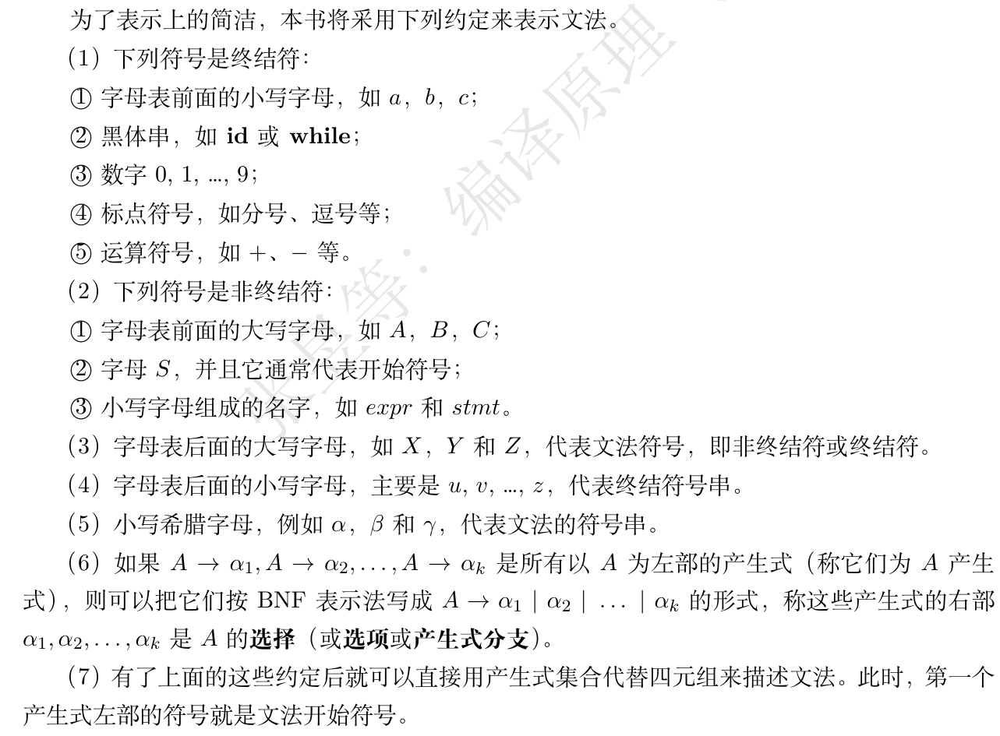

# 第三章 语法分析

在词法分析器给出词法记号序列之后，语法分析器（亦称分析器、解析器）接受这一序列并输出分析树的某种表示。

## 3.1 上下文无关文法

### 3.1.1 正规式的局限性

正规式虽然可以描述简单的语法结构，但是对于复杂的语法结构，比如说配对或者嵌套结构，正规式就不太适用了。下面给出几个例子。

* 集合$\{wcw|w是由a和b组成的串\}$不能用正规式描述，原因是正规式不能“记住”前面的串是何种形式。
* 语言$\{a^nb^n|n\geq 1\}$也不能用正规式描述，可以通过反证法来证明这一点。
  * 假如说这个语言可以用正规式描述，那么必然可以构造出识别这个语言的DFA。
  * 对于这个DFA，设其**只有$k$个状态**，且读入$\varepsilon、a、aa、\cdots、a^{k}$后进入状态$s_0、s_1、\cdots、s_{k}$。
  * 显然，由于容斥原理，这些状态之间**必须有两个是相同**的，不妨设$s_i=s_j$。
  * 现在，假设DFA读入了$a^{j}$后再读入$b^{i}$。
  * 由于$s_i=s_j$，DFA**应该接受$a^{j}b^{i}$**，但是这个串**不在语言**中，矛盾！

### 3.1.2 上下文无关文法的定义

上下文无关文法（Context-Free Grammar, CFG）可以描述更复杂的语法结构。一个上下文无关文法G是一个四元组$(V_N,V_T,P,S)$，其中：

* $V_T$是终结符的有限集合。
  * 终结符是**实际的句子**中出现的字符，它们**最终出现在句子中**。在讨论**编程语言的文法**时，**终结符**和**记号名**（见第二章）等价。
* $V_N$是非终结符的有限集合，其与终结符集合$V_T$**不相交**。
  * 非终结符**不会出现在最终的句子中**，而是用来**表示句子的结构**，它们可以通过**推导规则**转化为终结符。
  * 换言之，**非终结符定义了一组终结符串**。
  * 非终结符之间的关系（由**产生式集合$P$**给出）描述了语言的**层次结构**。
* $S\in V_N$是一个特殊的非终结符，称为**开始符号**。
  * 所有的句子都可以由开始符号推导出来。$S$定义的终结符串集，就是这个文法描述的语言。
* $P$是一组产生式的有限集合。
  * 每个产生式都是一个形如$A\rightarrow\alpha$的规则，其中$A\in V_N$，$\alpha\in(V_N\cup V_T)^*$。产生式的左部是一个非终结符，右部是一个由终结符和非终结符组成的串。
  * 开始符号至少出现在一个产生式的左部，否则，显而易见地，这个文法无法产生任何句子。

《编译原理》（第4版）中给出了一些文法表示的约定，本文以此为准：

### 3.1.3 正规式和上下文无关文法的比较

正规式能够描述的语言称作**正规语言**，上下文无关文法能够描述的语言称作**上下文无关语言**。正规语言是上下文无关语言的一个**真子集**，因此，上下文无关文法比正规式更强大。

特别地，可以将NFA描述的正规语言转化为上下文无关文法。也就是说，对于一个NFA，可以构造一个上下文无关文法，使得这个文法描述的语言和NFA描述的正规语言相同，下面给出算法：

* 首先，确定终结符集合$V_T$，它就是NFA的字母表。
* 接着，为NFA的每一个状态$s_i$引入一个非终结符$A_i$，指定$A_0$为开始符号，因为NFA的开始状态是$s_0$。
* 接着：
  1. 若NFA中有一条从$s_i$到$s_j$的边上标记为$a$，则在文法中添加产生式$A_i\rightarrow aA_j$。
  2. 若NFA中有一条从$s_i$到$s_j$的$\varepsilon$边，则在文法中添加产生式$A_i\rightarrow A_j$。
  3. 若$s_i$是NFA的接受状态，则在文法中添加产生式$A_i\rightarrow\varepsilon$。

### 3.1.4 正规式所存在的定理

尽管上下文无关文法如此强大，但是正规式的存在还是有意义的。

在描述词法分析器时，上下文无关文法显得过于复杂，并且按照它构造出的词法分析器也会过于复杂，正规式在词法分析方面仍然是一个有用的工具。

所以，在现代的编译器中，词法分析器和语法分析器是分离的。这样不仅可以简化词法分析器的设计，还可以使得词法分析器和语法分析器之间的接口更加清晰。

### 3.1.5 推导、句子和句型、最左推导和最右推导、左句型和右句型

给定了上下文无关文法后，为了描述文法定义的语言，需要找到一种方法来生成这个语言中的句子，这种方法就是**推导**。

**推导**是一种递归地，从**文法**推出**文法所描述的语言**中**合法串的集合**的过程。在推导过程中，从开始符号开始，**每一步推导**均将**非终结符**替换为**产生式右部**的**终结符**或**非终结符构成的串**。

> 上下文无关文法的“上下文无关”指，对于推导的每一步而言，**非终结符的替换只依赖于对应产生式的规定**，而不依赖于非终结符前后的内容。换言之，即对于任意句子$\alpha、\beta$，若$A\rightarrow\gamma$是一个产生式，那么必然有$\alpha A\beta\Rightarrow\alpha\gamma\beta$。

设上下文无关文法$G$的开始符号为$S$。从$S$出发，经过**一步或多步**推导，得到的所有**仅由终结符组成**的串的集合，称为$G$产生的语言。若两个文法产生的语言相同，则称这两个文法是**等价的**。

为方便今后讨论，定义**句型**和**句子**如下：

* 若从$S$出发，经过零步或多步推导，得到$\alpha$，则称$\alpha$是文法$G$的一个**句型**。
* 若从$S$出发，经过一步或多步推导，得到$w$，且$w$是仅由终结符组成的句型，则称$w$是文法$G$的一个**句子**。

自然地，从开始符号$S$出发，不断地使用产生式，**最终**可以得到一个**句子**。在构造句子的过程中所得的**代换序列**，被称作从开始符号到句子的**推导**。如果推导过程仅含一步代换，则用符号$\Rightarrow$表示。类似地，零步或多步推导用符号$\Rightarrow^*$表示，一步或多步推导用符号$\Rightarrow^+$表示。

在推导过程中出现的句型包含两个或多个非终结符时，下一步推导中代换哪个非终结符有多种选择。特别地，称：

* 每一步代换中，均选择**最左边的非终结符**代换的方式为**最左推导**，记作$\Rightarrow_{lm}$。
* 每一步代换中，均选择**最右边的非终结符**代换的方式为**最右推导**，也称为**规范推导**，记作$\Rightarrow_{rm}$。

若$S\Rightarrow_{lm}^*\alpha$，则称$\alpha$是文法G的一个**左句型**。若$S\Rightarrow_{rm}^*\alpha$，则称$\alpha$是文法G的一个**右句型**。

### 3.1.6 分析树

分析树是一种用来表示句子的推导过程的树形结构。分析树的每一个结点代表一个非终结符，每一条边代表一个产生式，叶子结点是终结符，而根结点是开始符号。

### 3.1.7 二义性

有些文法的一些句子存在不止一棵分析树。换言之，这些句子存在多种最左推导或最右推导。这种文法被称为**二义文法**。
**文法二义并不等价于语言二义**。一个语言可能有多个文法，其中**有些**文法是二义的，而**有些**文法是非二义的。只有当一个语言的**所有**文法都是二义的时候，这个语言才是二义的。

## 3.2 语言和文法

文法为语言提供了精准且易于理解的说明，且有些文法可以用自动的方法来生成高效的解析器。在这一过程中，有可能揭示文法的二义性和难以解析的语言构造，而这些问题有可能在设计阶段是难以发现的。

### 3.2.1 验证文法产生的语言

只需验证两件事情：

1. 文法产生的所有串都属于该文法定义的语言。
2. 该语言中的所有串都可以由该文法产生。

并不要求初学者掌握这种证明技术，但设计文法时若能以此方式思考，则更有可能设计出正确的文法。

### 3.2.2 无二义的表达式文法

本节相对于之前的有二义性表达式文法，给出了一个无二义的表达式文法，留待补充。

### 3.2.3 消除二义性

本节给出了一个通过重写$\mathbf{if-then-else}$表达式文法来消除二义性的例子，留待补充。

### *3.2.4 文法的种类

乔姆斯基（Chomsky）把文法分为四种类型，按描述能力从强到弱排列，四种文法分别为0型、1型、2型和3型，其中：

* 0型文法也称为**短语文法**，可以证明其能力相当于图灵机，即是递归可枚举的。
* 1型文法为上下文有关文法，在对非终结符作替换时，要依赖于上下文。
* 2型文法为本章之前所述的上下文无关文法。
* 3型文法为第二章所属的正规文法。

本节内容仅作扩展了解用，不在此展开更多内容。由于本系列文章多讨论上下文无关文法，故在不引起混淆的情况下，这里出现的“文法”均指上下文无关文法。

### *3.2.5 非上下文无关的语言

上下文无关文法已经能够描述大多数编程语言的语法结构，但是有一些语言的语法超出了上下文无关文法的描述能力。

比如说，本文一开始的$\{wcw|w是由a和b组成的串\}$实际上也不能用上下文无关文法描述，因为上下文无关文法无法“记住”前面的串是何种形式。

> “有趣的是”，上下文无关文法可以描述$\{wcw^R|w是由a和b组成的串\}$，这里$w^R$是$w$的逆序串。只需要取产生式集合$S\rightarrow aSa|bSb|\varepsilon$即可。

本节给出了用上下文有关文法描述$\{a^nb^nc^n|n\geq 1\}$的例子，留待补充。

## 3.3 自上而下解析

在进行语法分析时，有两种主要方法：自上而下（top-down）和自下而上（bottom-up），本节先讨论前者。

### 3.3.1 自上而下解析的一般方法

自上而下解析方法指从开始符号（分析树的根结点）出发，自上而下，从左到右地为输入串寻找最左推导（建立分析树，使得这棵分析树的叶子结点是输入串）。然而，这种方法在建立分析树时常常会匹配失败而引起回溯，这导致了该种解析方式效率低，代价高。

另外，自上而下解析的问题之一在于，它不支持左递归的文法。所谓左递归的文法，是指存在形如$A\Rightarrow^+ A\alpha$（其中$A$是非终结符）的推导的文法。左递归的文法会导致自上而下解析器陷入无限循环。

### 3.3.2 消除左递归

为了能够应用自上而下解析，需要消除文法中的左递归，本节分几种情况进行讨论。
先设$A$是一个非终结符，文法中存在这样的推导：$A\Rightarrow^+ A\alpha$。

#### 直接左递归

若文法中存在形如$A\rightarrow A\alpha|\beta$的产生式，则可以将其改写为$A\rightarrow\beta A'$，$A'\rightarrow\alpha A'|\varepsilon$两条产生式，这样就防止了左递归的出现，并且可以验证，改写后的文法和原来的文法产生的语言是相同的。不过，这样改写的代价在于可读性略有降低。

更一般地，假如有不止一条这样的递归产生式，比如说$A\rightarrow A\alpha_1|\cdots|A\alpha_n|\beta_1|\cdots|\beta_m$，亦可以将其改写为$A\rightarrow\beta_1A'|\cdots|\beta_mA'$，$A'\rightarrow\alpha_1A'|\cdots|\alpha_nA'|\varepsilon$。

#### 间接左递归

间接左递归，指通过多于一步的推导出现的左递归。比如说，$S\rightarrow Aa|b$，$A\rightarrow Sd|\varepsilon$。
为了消除间接左递归，可以先将其转化为直接左递归，然后再按照上述方法进行处理。
对于本例而言，这两条产生式可以改写为$S\rightarrow Aa|b$，$A\rightarrow Aad|bd|\varepsilon$，这样就将间接左递归转化为了直接左递归。
接着，按照消除直接左递归的方法，将$A\rightarrow Aad|bd|\varepsilon$改写为$A\rightarrow bdA'|A'$，$A'\rightarrow adA'|\varepsilon$。

#### 隐藏左递归

隐藏左递归相对难以检测，处理也更加麻烦，此处不左展开。

### 3.3.3 提左因子

提左因子也是一种文法变换。当不知道该如何替换某个非终结符$A$时（比如说，有形如$A\rightarrow \alpha\beta_1|\alpha\beta_2$的产生式），可以通过先将$A$扩展为$A'$，在知晓从$\alpha$推导出的结果后，再将$A'$替换为$\beta_1$或者是$\beta_1$的方式来处理。
也就是说，将$A\rightarrow \alpha\beta_1|\alpha\beta_2$改写为$A\rightarrow \alpha A'$，$A'\rightarrow\beta_1|\beta_2$。

### 3.3.4 LL(1)文法

对文法施加什么样的限制可以避免回溯呢？本节讨论LL(1)文法，它是一种能够避免回溯的文法。
LL(1)文法是指这样的一种文法：解析器在读入一个记号后，只需通过查看下一个记号，便可无二义性地决定如何进行推导。
>LL(1)的含义为"Left-to-right, Leftmost derivation, 1 token lookahead"，即从左到右，最左推导，向前看一个记号。

为了方便对LL(1)文法进行定义，先构造常用的两个集合：与符号串$\alpha$有关的集合$FIRST()$和与非终结符$A$有关的集合$FOLLOW()$。

* $\alpha$的$FIRST()$集合定义为：由$\alpha$推出的非空串中，首终结符组成的集合。特别地，当$\alpha$推出空串$\varepsilon$时，$FIRST(\alpha)$中包含空串。

  所以，$FIRST(\alpha)=\{a|\alpha\Rightarrow^*a\dots|a\in V_T\}\cup{\{\varepsilon|\alpha\Rightarrow^*\varepsilon\}}$。

* $A$的$FOLLOW()$集合定义为：在文法的所有合法句子中，$A$后面可能出现的终结符的集合。特别地，定义$\$$为输入串的结束符，若$A$是某个句型的最右非终结符，则$FOLLOW(A)$中包含$\$$。

  所以，$FOLLOW(A)=\{a|S\Rightarrow^*\dots Aa\dots|\in V_T\}\cup{\{\$|S \Rightarrow^* \dots A\}}$。

下面给出这计算这两个集合的算法。

首先，$FIRST(X), X\in V_T\cup V_N$可如下计算：

1. 若$X\in V_T$，则$FIRST(X)=\{X\}$。
   * 这是比较好理解的，因为终结符能推出的串只有它自己。
2. 若$X\in V_N$，则分情况讨论：
   1. 若$X\Rightarrow\varepsilon$，则将$\varepsilon$加入$FIRST(X)$。
      * 因为$X$可以推出空串，所以$X$的$FIRST$集合中应该包含空串。
   2. 若不然，则考虑每个形如$X\rightarrow Y_1Y_2\cdots Y_k$的产生式：
      1. 考虑$FIRST(Y_i)\space(1\leqslant i \leqslant k)$中的每个终结符$a$。
      2. 如果$a\in FIRST(Y_i)$，且$\varepsilon\in FIRST(Y_1),\cdots, FIRST(Y_{i-1})$，则将$a$加入$FIRST(X)$。
         * 因为$a$可能作为首终结符，所以$X$的$FIRST$集合中应该包含$a$。
      3. 如果$\varepsilon\in FIRST(Y_1),\cdots, FIRST(Y_k)$，则将$\varepsilon$加入$FIRST(X)$。

接着，便可以计算$FIRST(X_1X_2\cdots X_k)$，其中$X_i\in V_T\cup V_N$。这个集合的计算方法是：

1. 考虑$FIRST(X_1)$中的每个终结符$a$，将$a$加入$FIRST(X_1X_2\cdots X_k)$。
2. 如果$\varepsilon\in FIRST(X_1),\cdots, FIRST(X_{i-1})$，则将$FIRST(X_i)$中的每个终结符$a$加入$FIRST(X_1X_2\cdots X_k)$。
3. 如果$\varepsilon\in FIRST(X_1),\cdots, FIRST(X_k)$，则将$\varepsilon$加入$FIRST(X_1X_2\cdots X_k)$。

最后，$FOLLOW(A), A\in V_N$可如下计算：
> 值得一提的是，$FOLLOW$集合的计算是一个迭代的过程，而且不同非终结符的$FOLLOW$集合之间是相关的，故必须多次计算，直至所有的$FOLLOW$集合不再变化。
>
1. 将$\$$加入$FOLLOW(S)$，其中$S$是文法的开始符号。
2. 若存在形如$A \rightarrow \alpha \boldsymbol{B \beta}$的产生式，则将$FIRST(\beta)$中的所有终结符**加入**到$FOLLOW(B)$中。
3. 若存在形如$A \rightarrow \alpha \boldsymbol{B}$的产生式，或有$A \rightarrow \alpha B\boldsymbol{\beta}$且$\varepsilon\in FIRST(\beta)$，则将$FOLLOW(A)$中的所有终结符**加入**到$FOLLOW(B)$中。

现在，可以借助$FIRST$和$FOLLOW$集合来定义LL(1)文法了。
假如文法任何形如$A\rightarrow\alpha|\beta$的两个推导式均满足以下条件，则称这个文法是LL(1)文法：

* $FIRST(\alpha)\cap FIRST(\beta)=\emptyset$，即$\alpha$和$\beta$的首终结符不相交。
* 若$\beta \Rightarrow^* \varepsilon$（即$\beta$可以推出空串），则$FIRST(\alpha)\cap FOLLOW(A)=\emptyset$，即$\alpha$的$FIRST$集合和$A$的$FOLLOW$集合不相交。

#### LL(k)文法

假如将$FIRST$集合的计算扩展到$k$个记号，即$FIRST_k$集合，那么可以定义LL(k)文法。
具体而言，$FIRST(k, \alpha)$定义为：由$\alpha$推出的非空串中，前$k$个终结符组成的集合。特别地，当$\alpha$推出空串$\varepsilon$时，$FIRST(k, \alpha)$中包含空串。

假如文法任何形如$A\rightarrow\alpha|\beta$的两个推导式均满足以下条件，则称这个文法是LL(k)文法：

* $FIRST(k, \alpha)\cap FIRST(k, \beta)=\emptyset$。
* 若$\beta \Rightarrow^* \varepsilon$，则$FIRST(k, \alpha)\cap FOLLOW(A)=\emptyset$。

> 顾名思义，LL(k)文法表示需要向前看$k$个记号才能决定解析器如何进行推导。

## 3.4 自下而上解析（还没讲到，待施工）

本节讨论另外一种语法分析的方法——自下而上解析。
自下而上解析从输入串出发，尝试利用产生式规则进行规约，直至得到开始符号。所谓“归约”，就是根据产生式规则，将与产生式右部相匹配的串替换为产生式左部的符号。
这是一种更加一般化的方法，颇有“逆向推导”的意味。
